# Visualizations
Following are some of the visualizations resulted from this project.
### Title for `age-hist.png`
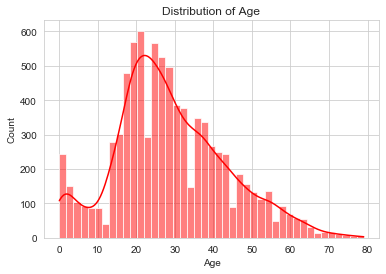

<small><i>Image: age-hist.png</i></small>
 
### Title for `contingency-tables.png`
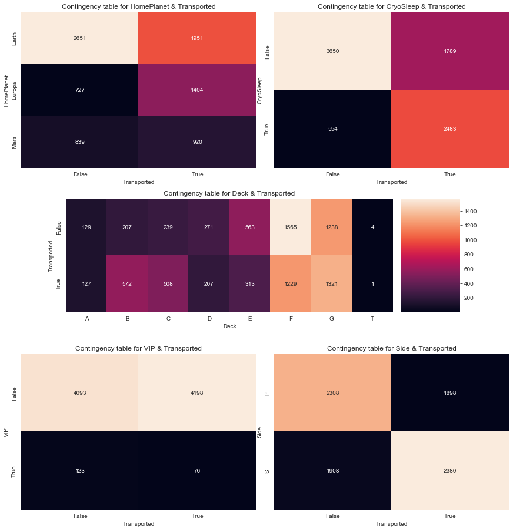

<small><i>Image: contingency-tables.png</i></small>
 
### Title for `cryosleep-cp.png`
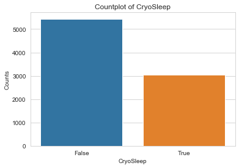

<small><i>Image: cryosleep-cp.png</i></small>
 
### Title for `deck-cp.png`
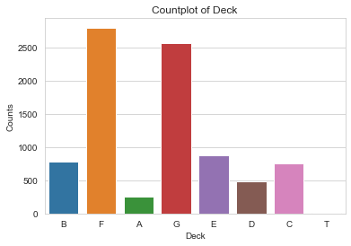

<small><i>Image: deck-cp.png</i></small>
 
### Title for `destination-cp.png`
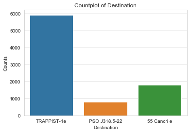

<small><i>Image: destination-cp.png</i></small>
 
### Title for `foodcourt-hist.png`
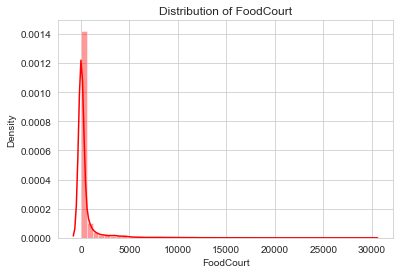

<small><i>Image: foodcourt-hist.png</i></small>
 
### Title for `homeplanet-cp.png`
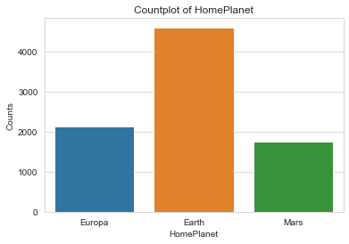

<small><i>Image: homeplanet-cp.png</i></small>
 
### Title for `model-perf.png`
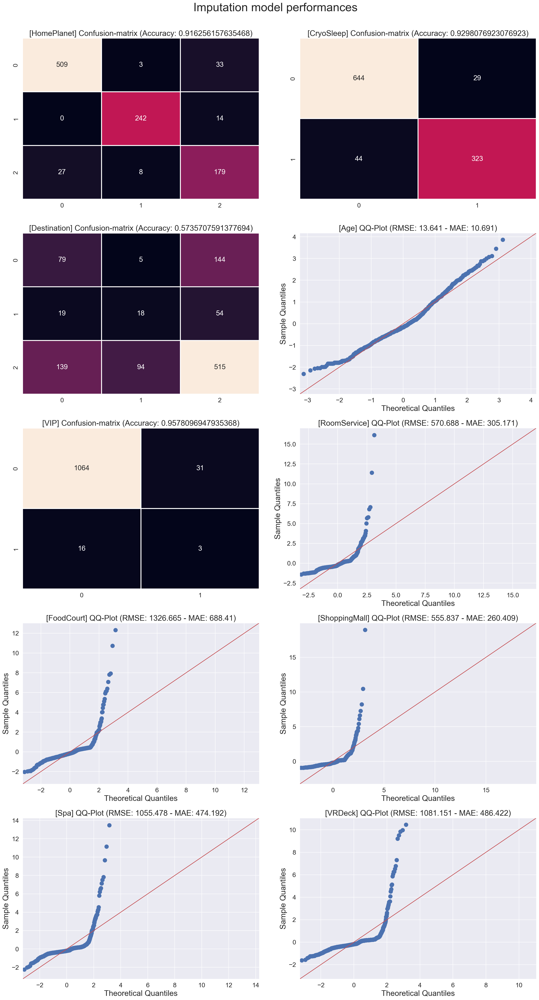

<small><i>Image: model-perf.png</i></small>
 
### Title for `num-hist.png`
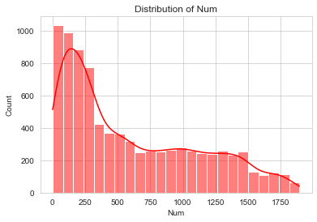

<small><i>Image: num-hist.png</i></small>
 
### Title for `roomservice-foodcourt-scatter.png`
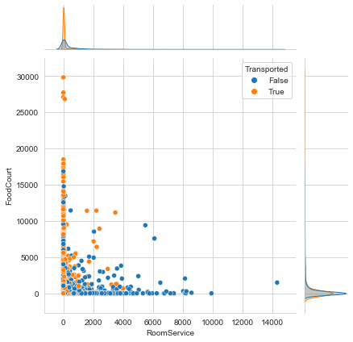

<small><i>Image: roomservice-foodcourt-scatter.png</i></small>
 
### Title for `roomservice-hist.png`
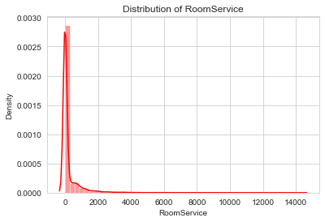

<small><i>Image: roomservice-hist.png</i></small>
 
### Title for `shoppingmall-hist.png`
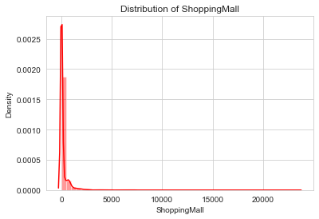

<small><i>Image: shoppingmall-hist.png</i></small>
 
### Title for `side-cp.png`
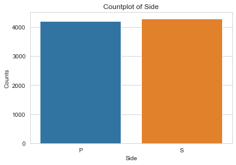

<small><i>Image: side-cp.png</i></small>
 
### Title for `spa-hist.png`
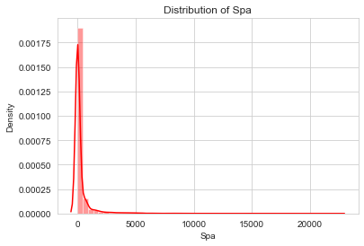

<small><i>Image: spa-hist.png</i></small>
 
### Title for `transported-cp.png`
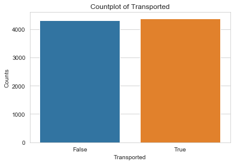

<small><i>Image: transported-cp.png</i></small>
 
### Title for `vip-cp.png`
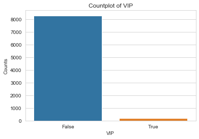

<small><i>Image: vip-cp.png</i></small>
 
### Title for `vrdeck-hist.png`
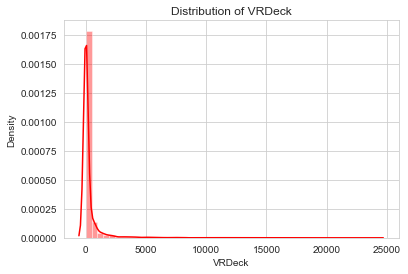

<small><i>Image: vrdeck-hist.png</i></small>
 